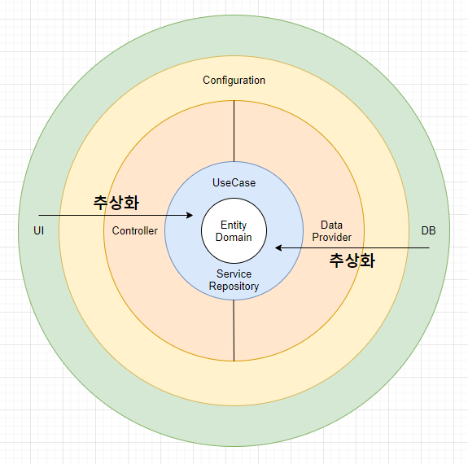
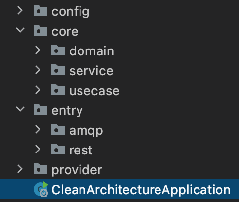

<!-- omit in toc -->
# 클린 아키텍처를 적용한 미세먼지 API

클린 아키텍처를 적용하여 미세먼지 경보 발령 현황을 확인할 수 있는 간단한 Back-end API 서버  
Front는 test code 로 생략한다.  
Back-end는 Spring boot, Rabbit MQ, Redis, Open API 로 구현하여 일일 조회량인 500 트래픽을 극복한다.

<!-- omit in toc -->
## 목차

- [1. 프로젝트 구성도](#1-프로젝트-구성도)
  - [1.1. 시스템 구성도](#11-시스템-구성도)
  - [1.2. 요구사항](#12-요구사항)
- [2. 클린 아키텍처 해석](#2-클린-아키텍처-해석)
  - [2.1. 재해석한 클린 아키텍처](#21-재해석한-클린-아키텍처)
  - [2.2. 패키지 구조](#22-패키지-구조)
  - [2.3. 디펜던시 룰](#23-디펜던시-룰)
- [3. 클린 아키텍처 정리](#3-클린-아키텍처-정리)
- [4. 참고](#4-참고)
- [5. 기타](#5-기타)

## 1. 프로젝트 구성도

### 1.1. 시스템 구성도

### 1.2. 요구사항

- 미세먼지 경보 발령 현황 검색 결과를 REST API로 제공한다.
- 미세먼지 경보 발령 현황 데이터 조회는 OPEN API를 사용한다. ([https://data.go.kr/iim/api/selectAPIAcountView.do](https://data.go.kr/iim/api/selectAPIAcountView.do))
- 사용자의 요청이 있을 때마다 OPEN API를 바로 호출하지 않고, 미리 저장해놓은 Redis에서 데이터를 조회해서 가져온다.
- 어드민에서 주기적으로 메시지를 API에 전송해서, OPEN API 결과(미세먼지 현황)를 Redis에 Update한다.

## 2. 클린 아키텍처 해석

### 2.1. 재해석한 클린 아키텍처

- Entity, Domain : 엔티티 정의
- UseCase : 비즈니스 규칙 정의
- Service, Repository : 비즈니스 규칙 정의, UseCase 구체화
- Controller : 애플리케이션 API 엔드포인트
- Data Provider : UseCase 또는 Service, Repository 구현체
- Configuration : External Interface 구현체 설정
- User Interface : 프론트
- Database : 데이터 저장소

### 2.2. 패키지 구조

- core(UseCase, Entity, Domain, Service, Repository)
  - 가장 추상화 수준이 높은 영역
  - 추후 몸집이 커질시 멀티모듈, 서브모듈로 구성
- entry(Controller, Message Listener)
  - API 엔드포인트
  - 메세지 엔드포인트
- provider(UseCase, Service, Repository의 구현체)
- config(External Interface 구현체 설정)

### 2.3. 디펜던시 룰

원의 안쪽으로 갈수록 추상화의 수준은 높아진다.  
비즈니스영역이 변화되면 바깥쪽 영역까지 영향을 끼치는 것은 당연하다. 허나 그 반대인 외부의 변화로 내부원 영역인 비즈니스영역에 영향을 주면 안된다.  
즉, Data Provider는 Repository에 대해서 잘 알고있기 때문에, Repository가 변경이 되면 Data Provider도 변경을 해야한다.  
하지만 반대로 Data Provider가 변경이 된다고해서 Repository에 영향을 주면 안된다는 것이다.  
Repository 입장에선 Data Provider가 변경이 된다거나, DB가 변경된다는 사실을 전혀 알 필요가 없고 결과값만 잘 받아오면 된다.  
이처럼 영역을 분리하고 추상화 수준을 높인 것이 바로 클린 아키텍처의 디펜던시 룰이다.

## 3. 클린 아키텍처 정리

image

## 4. 참고

[https://brunch.co.kr/@springboot/228](https://brunch.co.kr/@springboot/228)

## 5. 기타

클린 아키텍처를 검색하다 평소에 생각해오던 사상과 거의 흡사한 글을 발견하고 생각을 구체화하기 위해 코드로 옮겼다.  
블로그와 동일한 소스이지만, 백문이불여일타! 배우는게 많았다.
